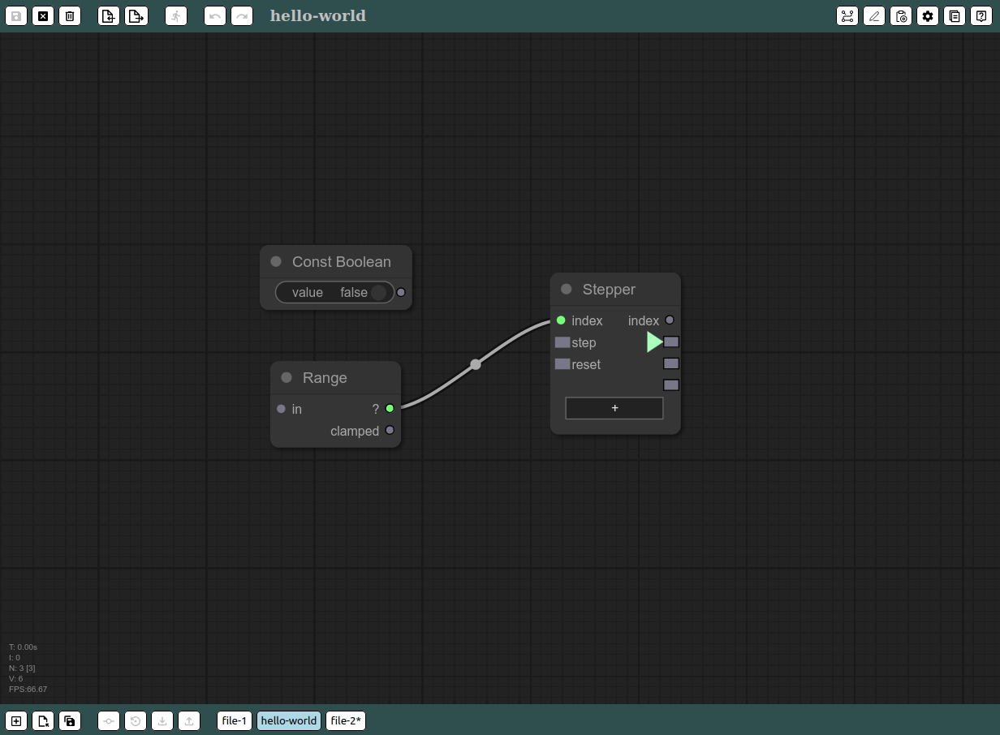
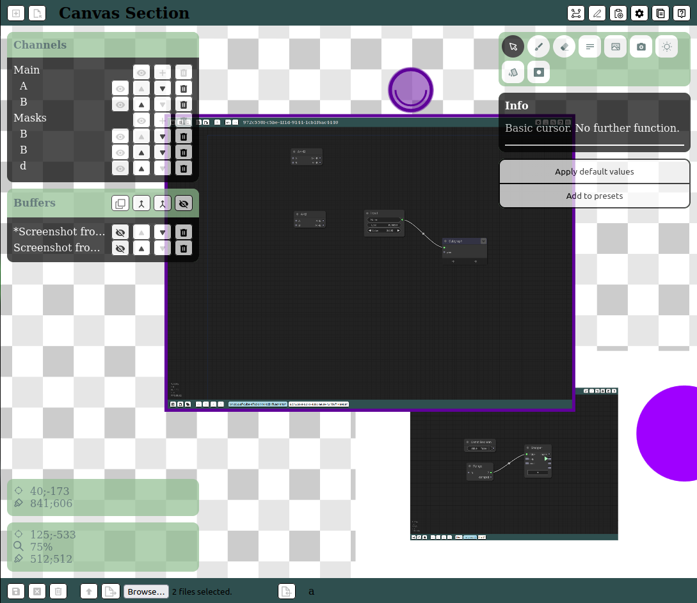

## Node paradise

Not really, more like a 2am nightmare of barely working ts/js code.  
This repository is a svelte wrapper for litegraph.js to provide history, multiple files, metadata and few more features.  
Design-wise, it is a mostly implemented code base for visual editors of domain specific node-based languages.  
Ideally it is going to be integrated in a tauri application.

### Integration

This repository is just boilerplate.
It means that all the application specific bits are not implemented.  
To have a functional product you will need at least:

- Custom nodes.
- FS or DB operations being performed by the backend. At this stage it is all volatile in memory.

Right now only the _workflows_ section is more or less usable.  
All the others are just placeholders.

### Dependencies

It is based on a custom version of [litegraph.js](https://github.com/KaruroChori/litegraph.js) since it needed some additional bugfixing.  
Download it locally, and compile the build version. I will soon be providing a trimmed version with updated build files unlike the original repository, but for now this is the proces.

## Documentation

Documentation is a work in progress.  
The initial version can be found [here](./docs/)

## Why?

I am trying to build a mixture of [comfyui](https://github.com/comfyanonymous/ComfyUI) + [openoutpaint](https://github.com/zero01101/openOutpaint) + automatic pipelines, but I wanted the basic repository to stay as abstract as possible.  
This project is basically all the generic boilerplate, albeit quite opinionated considering the target I have in mind.
